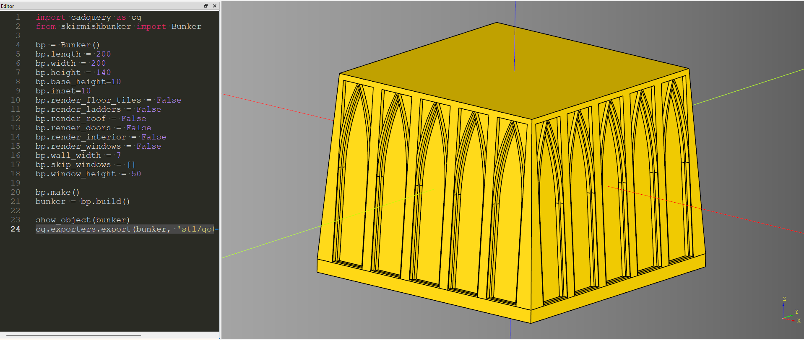
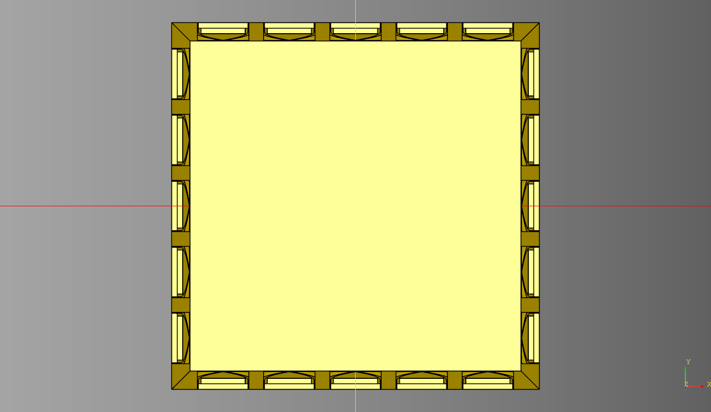
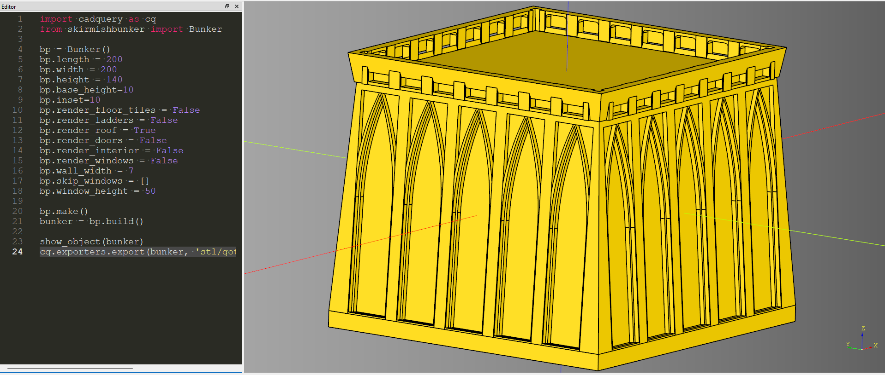
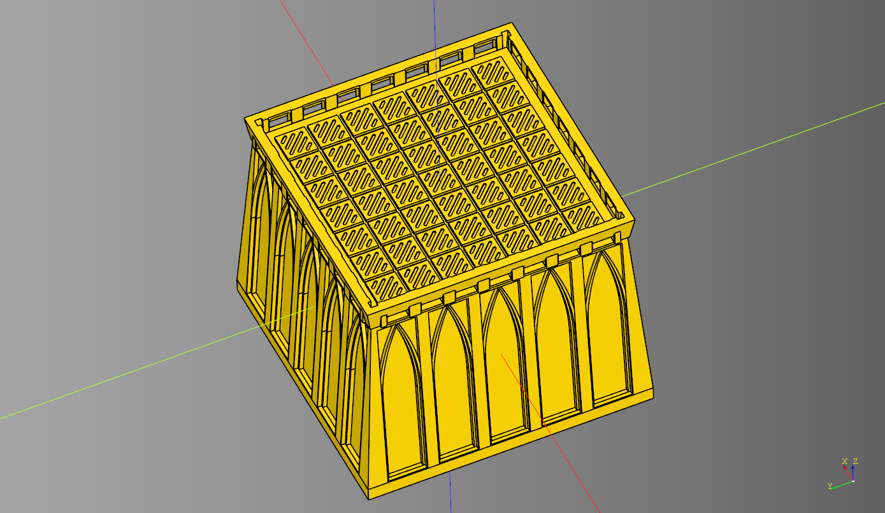
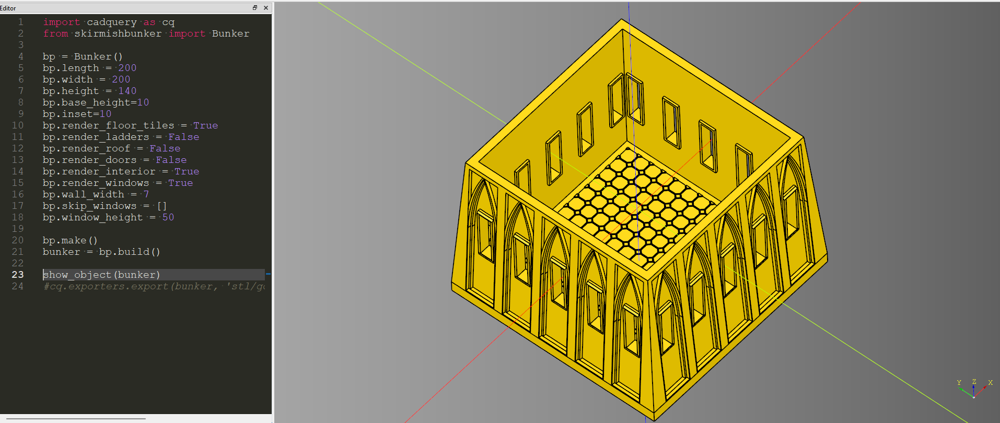

# Gothic Pedastal

## Solid Pedastal

* Length 200mm
* Width 200mm
* Height 150mm

* [code](code/gothic_pedastal.py)
* [stl render](stl/gothic_pedastal.stl)

 
With an inset of 10mm the top is 180mm x 180mm

## With Roof

* [code](code/gothic_pedastal_interior.py)
* [stl render](stl/gothic_pedastal_with_roof.stl)

**Roof With Tiles** 

## Cutout Interior and Windows

* [code](code/gothic_pedastal_roof.py)
* [stl render](stl/gothic_pedastal_interior_windows.stl)

## Proposed Model

* [code](code/gothic_pedastal_roof_interior.py)
* [stl render](stl/gothic_pedastal_roof_interior.stl)

* [stl render](stl/gothic_pedastal_roof_interior_plate.stl)
