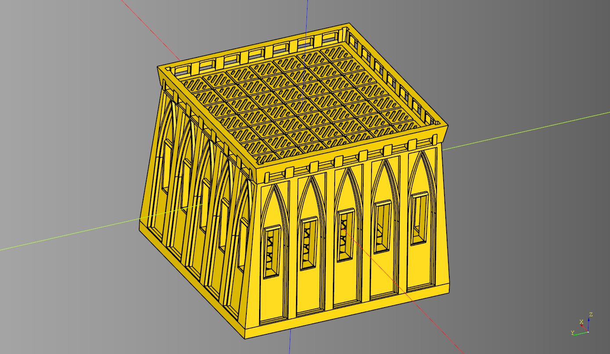
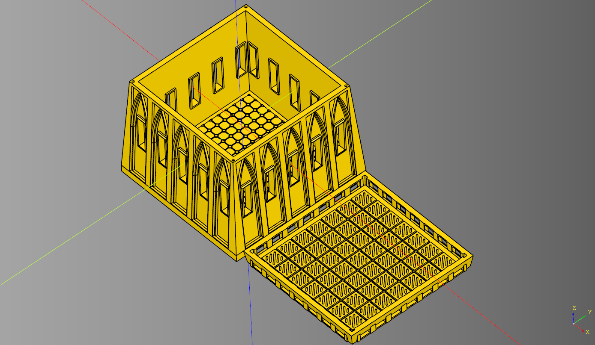
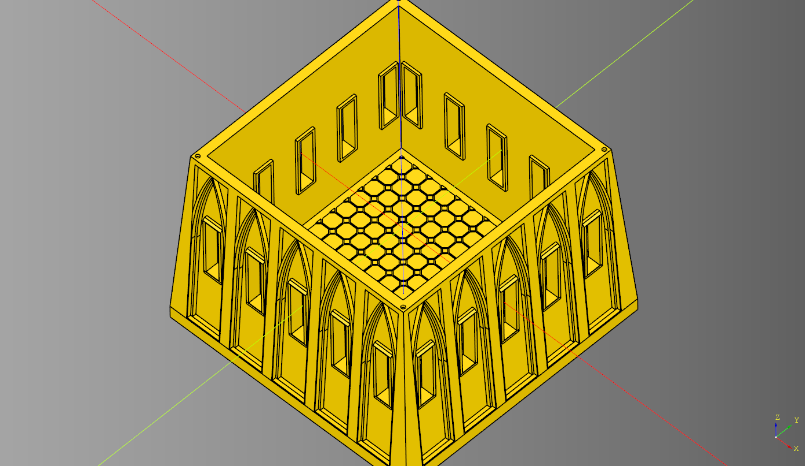
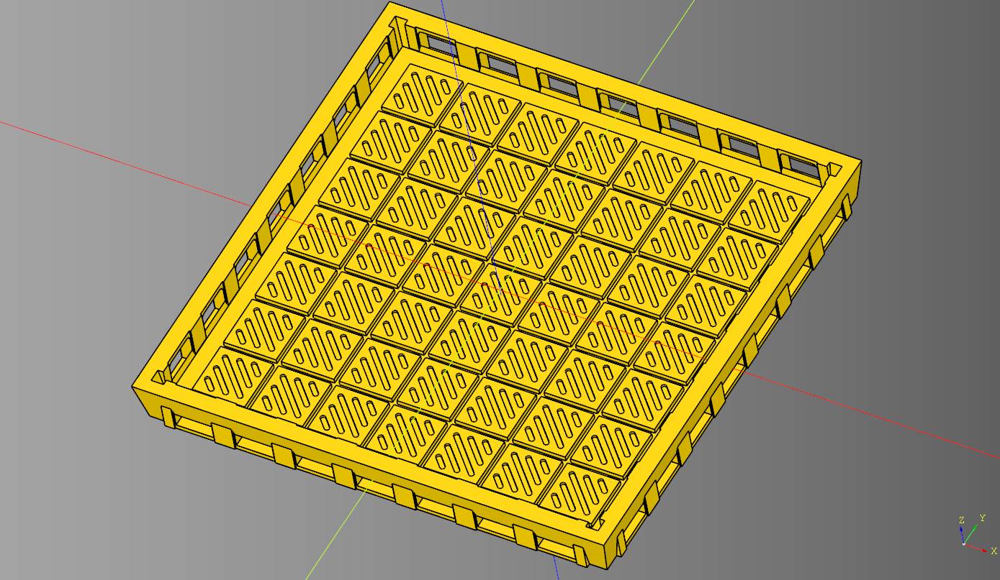
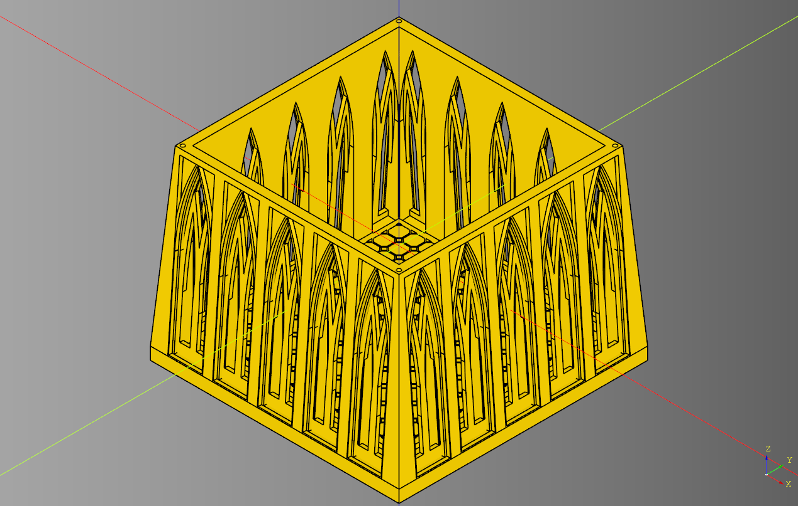
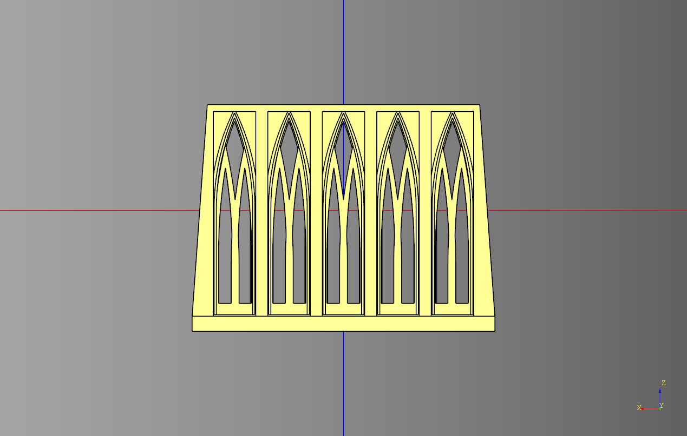

# Gothic Pedastal
* Parts 18 - Base, Roof, 12 magnets
* Length 200mm
* Width 200mm
* Height 168mm
* weight 618grams
* Print Time 3 days 12 hours 15 minutes
* No Support Material
* printed with Brim

* [code](code/gothic_pedastal_roof_interior.py)
* [stl render](stl/gothic_pedastal_roof_interior.stl)

* [stl render](stl/gothic_pedastal_roof_interior_plate.stl)

## Parts

### Body

* Length 200mm
* Width 200mm
* Height 150mm
* weight 498grams
* Print Time 2 days 18 hours 36 minutes
* No Support Material
* printed with Brim

### Roof

* Length 188mm
* Width 188mm
* Height 18mm
* weight 128grams
* Print Time 18 hours 43 minutes
* No Support Material
* printed with Brim

---
## Arch Body Option
  

* [stl render](stl/gothic_pedastal_arch.stl)
